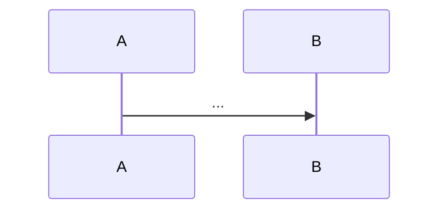

# TDD Orchestration

Kent Beck 流の TDD を、main session (Conductor) と subagent 群 (Implementer / Reviewer) の役割分担で効率よく回すための workflow。

## Kent Beck の2つのルール

1. **自動化されたテストが失敗した時だけ、新しいコードを書く**
2. **重複を除去する**

すべての実践技法はこの2つから派生する。

## 三役の責務

| 役 | 担当 | 責務 |
|---|---|---|
| **Conductor** | main session 自身 | TODOリスト管理 / 各フェーズの dispatch / **全体ビルド・全体テストの実行と最終状態確認** (個別実行は補助のみ) / Baby Steps の歩幅判断 / コミット / commit 完了後の再検証 / TASK_BASE 管理と autosquash |
| **Implementer** | `code-implementation-expert` | Red phase で**仕様テスト群**を書く / Green phase で全仕様テストを緑にする最小実装 / 指示された refactor を適用 |
| **Reviewer** | `project-consistency-reviewer` | Green 状態のコードを read-only 分析。指摘 + **関数シグネチャ before/after** + **新規/変更テスト一覧** を必ず出力。これは commit body にそのまま転記される |
| (補助) | `test-failure-analyzer` | 想定外 test failure を「実装ミス / テストミス / 仕様ミス」に分類 |
| (補助) | `build-error-fixer` | コンパイル/lint エラーが Red/Green を阻害する時 |

Conductor は subagent ではない。この skill を読んだ Claude 自身が Conductor として振る舞う。

## サイクル (タスク 1 つ = サイクル 1 周)

```
[0] Conductor: TODOリストにタスクを列挙 (TodoWrite)
              タスク開始時に TASK_BASE = `git rev-parse HEAD` を記録
[1] Red    : Implementer dispatch → 仕様テスト群 (N個) を追加
              📝 仕様テスト一覧 (シナリオ/期待振る舞い/対応する完了条件)
[2] Verify : 全体ビルド + 全体テスト → ビルド成功 AND 仕様テスト群が ≥1 失敗
              全部緑ならテスト不足 → Implementer 再依頼
              ビルド失敗 → build-error-fixer dispatch
[3] Green  : Implementer dispatch → 仕様テスト群を全て緑にする最小実装
              内部で Baby Steps の inner loop を使ってよい
              📝 設計図 (mermaid sequenceDiagram)
[4] Verify : 全体テスト → 仕様テスト + 既存テスト 全 green
[5] Review : Reviewer dispatch (read-only)
              📝 重複/改善指摘 + signature before/after + 追加テスト一覧
[6] Commit1: feat/fix で commit (body に [1][3][5] の成果物)
              commit 後 全体ビルド + 全体テスト で再検証
[7] Refact : Implementer dispatch → Reviewer 指摘のうち適用すべき分のみ反映
              不要ならスキップして [11] へ
[8] Verify : 全体テスト → 緑のまま
[9] Review2: Reviewer dispatch → refactor 後の signature 差分を再取得
[10]Commit2: refactor で commit (body に [9] の signature 差分 + 適用した改善内容)
              commit 後 全体ビルド + 全体テスト で再検証
[11]Squash : autosquash 実行 (詳細は「タスク完了時の autosquash」節)
              実行後 全体ビルド + 全体テスト で再検証
              最終 commit log を user に提示
       ↓ 次の TODO タスクへ。リスト枯渇で終了
```

**Tidy First で先に整頓する場合**: [1] の前に preliminary refactor commit を 1 本入れる (`refactor: 後続の追加に備えて X を抽出`)。

## Red phase の粒度 (仕様テスト群)

Red phase は古典的「1 テストずつ」ではなく、**タスクの完了条件を表現する仕様テスト群**を一括で書く。これにより:

- タスクの「done」が**コードで明文化**される (テスト一覧 = acceptance criteria)
- Conductor は仕様テスト全緑をもってタスク完了と判定できる (主観排除)
- Green phase 内で Baby Steps を使う場合もゴールが明確

**含めるべきもの**:
- 正常系の代表ケース
- 主要な異常系 (失敗 / 例外)
- 境界値 (空 / 最大 / 0 / 負 など振る舞いが変わる点)
- タスクが触れる**重要な不変条件** (並行性 / 順序性 / 冪等性)

**含めなくてよいもの**:
- 実装詳細のテスト (private 関数の挙動)
- 仕様外の網羅的組み合わせ (property test や別タスクへ)

**仕様テスト数が 10 を超えたら**: タスク自体を分割する (TODO を再編)。

## Conductor の検証責務

各 phase の verify と**各 commit 完了後**に、**プロジェクト全体実行**で状態確認する。個別モジュール実行 (`cargo test -p foo` 等) は局所確認に留め、合否判断は常に全体実行で下す。

| タイミング | verify 内容 | コマンド例 |
|---|---|---|
| **Red phase** [2] | 全体ビルドが通る AND 仕様テスト群が ≥1 失敗 | `cargo build && cargo test` / `npm run build && npm test` / `go build ./... && go test ./...` |
| **Green phase** [4] | 全体テストが全て通る | `cargo test` / `npm test` / `go test ./...` |
| **Refactor 後** [8] | 全体テスト依然 green | 同上 |
| **commit 完了後** [6][10][11] | 再度 全体ビルド + 全体テスト (pre-commit hook が変更を加えている可能性に備える) | 同上 |

**全体実行を主体とする理由**: 個別実行では予期せぬ regression を見逃す。TDD の安心感は「全テスト緑」状態で担保される。「動いた範囲の確認」ではなく「壊れていないことの確認」を優先。

**Red phase で build を必須にする理由**: コンパイルエラーで止まっているのは正しい意味の Red ではない。型システムを持つ言語ではテストがリンクされ実行され assert で失敗していることまで確認する。

### 検証失敗時の分岐

```
全体ビルド失敗
  → build-error-fixer dispatch → Implementer 再依頼で修正

全体テスト失敗 (Red で仕様テスト群以外まで失敗 = regression)
  → test-failure-analyzer dispatch で分類
  → テストミスなら Implementer 修正、仕様ミスなら user に確認

全体テスト失敗 (Green で仕様テストの一部が緑にならない)
  → Implementer 再依頼。3 回失敗で Baby Steps を半分に後退
  → 仕様テスト群が大きすぎる場合はタスク分割を user に提案

commit 後検証で失敗
  → pre-commit hook が壊した可能性 → 直近 commit の diff を user と確認
```

## Implementer dispatch テンプレート

### Red 時

```
このタスクの完了条件を表現する**仕様テスト群**を追加してください。1つとは限らない —
正常系 / 異常系 / 境界値 / 重要な不変条件 (並行性・順序性・冪等性等) を網羅し、
このテスト群が全て緑になることをタスクの「done」と定義できる粒度で書く。

実装ファイルは触らない。

完了時に以下を報告:
- 仕様テスト一覧 (各テストの対象シナリオ / 期待される振る舞い / 対応する完了条件)
- 仕様テスト数が 10 を超えそうならタスク分割の提案

タスク内容: <Conductor がタスク仕様を記述>
```

### Green 時

```
Red phase で書かれた仕様テスト群を**全て**緑にする最小実装を行う。

内部で Baby Steps の inner loop を使ってよい (1 テストずつ緑にする)。
戦略は以下から選択し選択理由を報告:
- Fake It: ハードコード値を返す → 後続テストで一般化を強制
- Triangulation: 複数テストから一般化を導く
- Obvious Implementation: 自明なら直接書く

完了時に以下を出力:
- 採用した戦略と理由
- **設計図** mermaid sequenceDiagram (必要なら classDiagram も)
  主要コンポーネント間のメッセージフローが分かる粒度で十分

仕様テスト群: <Red phase の出力をここに>
```

### Refactor 時

```
以下の Reviewer 指摘のうち、今のコミットに含めるべきものだけを反映する。
振る舞いは変えない。テストは緑のままを維持。

Reviewer 指摘:
<Review の出力をここに>

優先度: <Conductor が指定>
```

## Reviewer dispatch テンプレート

```
直近の green に到達した差分 (`git diff $TASK_BASE..HEAD` 相当) を分析し、
以下を**全て**出力する。コードは変更しない。

1. **指摘事項** (適用優先度付き)
   - 重複
   - 命名 / パターン違反
   - refactor 機会
   - テスト追加機会

2. **関数シグネチャの変化**
   変更/追加された関数を `before -> after` 形式で列挙
   例: before: fn calc(price: u32) -> u32
       after:  fn calc(price: Money) -> Money

3. **新規/変更されたテスト一覧**
   `テスト名: 1行概要` 形式で列挙
   例: testFooReturnsBar: 正常系で Bar を返す
       testFooThrowsOnNull: null 入力時に例外を投げる

出力 2 と 3 はそのまま commit body に転記される。
```

## Baby Steps の判断基準

- **不安なら歩幅を小さく、自信があれば大きく**
- 検証失敗時は次の歩幅を**半分**にする
- コンパイルエラーすら一度に 1 つだけ解消する
- リファクタリングは 1 ステップごとに全体テスト
- 1 サイクルが 30 分超えたら歩幅を半分に再検討

## 3つの実装戦略の使い分け

| 戦略 | 使う時 | 例 |
|---|---|---|
| **Fake It** | 実装方針が見えない / 1 テストしかない | `return 42;` で通し、次のテストで一般化を強制 |
| **Triangulation** | 複数のテストから抽象化したい | テスト2つ目を追加して条件分岐や式を導く |
| **Obvious Implementation** | 実装が完全に自明 | テストを書いた直後に正しい実装を直接書く |

## コミット形式の規定

### 基本ルール (CLAUDE.md 準拠)

- **言語**: 日本語
- **形式**: Conventional Commit `<type>(<scope>): <subject>`
- **type**: `feat` / `fix` / `refactor` / `test` / `docs` / `chore`
- **scope**: 影響範囲 (例: `auth`, `parser`)。なくてもよい
- **subject**: 命令形・体言止めの簡潔な日本語、句点なし
- **本文**: 「なぜ」を書く。「何を」は diff で分かる
- **Pre-commit**: lint / format を必ず通してから commit

### Tidy First? — type 使い分け

**構造変更 (Structural)** と **振る舞い変更 (Behavioral)** を**必ず別 commit** にする。

| 段階 | type | 例 |
|---|---|---|
| Red→Green 完了 (新規振る舞い) | `feat` | `feat(parser): 空文字列を許容するパース処理を追加` |
| バグ修正 (既存振る舞い変更) | `fix` | `fix(auth): セッション期限切れ時に401を返す` |
| Refactor フェーズ (構造のみ) | `refactor` | `refactor(parser): 重複したバリデーション処理を抽出` |
| Tidy First (実装前の準備整頓) | `refactor` | `refactor(parser): 後続の追加に備えてヘルパー関数を抽出` |
| テストのみ追加/修正 | `test` | `test(parser): 境界値ケースを追加` |

**判断基準**: 「この commit を revert したら振る舞いが変わるか?」
- 変わる → `feat` / `fix`
- 変わらない (内部構造のみ) → `refactor`

### commit body のテンプレート

#### `feat:` / `fix:` (Red→Green を含む commit)

````
<type>(<scope>): <subject>

## テスト概要
<Implementer の Red 完了時出力をここに>
- 対象シナリオ: ...
- 期待される振る舞い: ...
- なぜ今このテストを書くか: ...

## 設計図
<Implementer の Green 完了時 mermaid 図をここに>


## 追加/変更テスト
<Reviewer のテスト一覧出力をここに>
- testFooReturnsBar: 正常系で Bar を返す
- testFooThrowsOnNull: null 入力時に例外を投げる
````

#### `refactor:` (Refactor フェーズの commit)

```
refactor(<scope>): <subject>

## 改善内容
<Reviewer 指摘のうち適用したものをここに>
- 重複した X を Y に抽出
- Z の命名を A に変更

## 関数シグネチャ変化
<Reviewer の signature diff 出力をここに>
- before: fn calc(price: u32) -> u32
- after:  fn calc(price: Money) -> Money
```

### 修正コミット

- 同一サイクル内の小さな修正は `git commit --fixup <hash>` を使う
- `git commit --amend` は user 明示指示時のみ
- autosquash は**タスク完了時のみ** Conductor が自動実行 (次節)

## タスク完了時の autosquash

タスクの全仕様テストが緑になり Refactor まで終わったら、Conductor は **fixup commit を autosquash で取り込み**、最終 commit 列が論理単位だけになるよう整える。

### 目的

- サイクル中に発生した小修正 (タイポ / lint 違反 / レビュー反映漏れ) が独立 fixup として残ると history が雑然とする
- タスク終了時点で `feat:` / `refactor:` などの**論理単位**だけが残る状態にする
- 各 commit が単独で revert / レビュー可能な状態を保つ

### 安全条件 (これを満たせば user 承認なしで自動実行してよい)

このskill の autosquash は **user 承認を省略** する。安全性は **base の厳密な特定**で担保する。

1. **タスク開始時に HEAD を記録**: `[0]` で `git rev-parse HEAD` を取得し `TASK_BASE` として保持
2. **TASK_BASE が upstream の祖先**: `git merge-base --is-ancestor $TASK_BASE @{upstream}` が真 (push 済み history を巻き戻さない)。upstream が未設定なら check skip
3. **TASK_BASE..HEAD の commit が全て自分の作業**: `git log --format=%an $TASK_BASE..HEAD | sort -u` が現在の git user (`git config user.name`) のみ。違う名前があれば停止して user 相談
4. **実行コマンドは固定形式のみ**: `GIT_SEQUENCE_EDITOR=: git rebase -i --autosquash $TASK_BASE`

この 4 条件全て満たせば user 承認なしで実行。1 つでも欠けたら user に相談。

### 手順

```
[1] TASK_BASE を取得 (タスク開始時に記録した HEAD)
[2] 安全条件 (上記 4 条件) を全てチェック
       NG → user に相談、autosquash スキップ
       OK → 次へ
[3] git log --oneline $TASK_BASE..HEAD で commit 群を列挙
[4] fixup commit があるか確認
       ない → squash 不要、user に最終 log 提示して完了
       ある → 次へ
[5] 非対話で autosquash 実行 (user 承認なし):
       GIT_SEQUENCE_EDITOR=: git rebase -i --autosquash $TASK_BASE
[6] 全体ビルド + 全体テスト で再検証
       失敗 → user に報告。git reset --hard ORIG_HEAD で戻せる旨を伝える
[7] git log --oneline $TASK_BASE..HEAD で最終 log を user に提示
[8] 完了。次タスクの開始時に新しい TASK_BASE を記録
```

### autosquash 不要な場合 (skip 条件)

以下を全て満たせば skip してよい:
- fixup commit が 1 つもない
- 通常 commit が 2 つ以下 (`feat` + 任意の `refactor`)
- 全 commit message が論理単位として完結

### CLAUDE.md との関係

CLAUDE.md は通常 `git rebase --autosquash` の自動実行を禁じているが、`## History Modification` セクションに**この skill 専用の例外条項**が明記されている (TASK_BASE 厳密特定 + 4 安全条件)。

## git 操作の安全規定 (CLAUDE.md 準拠)

- `git add` は Conductor が自分で行う
- `git commit --amend` / `git rebase` (autosquash 例外を除く) / `git reset --hard` / `git push --force` は**自動実行しない**
- history を書き換える操作は autosquash の例外条件以外すべて user 確認必須
- push は user 明示指示時のみ

## 効率化テクニック

- Conductor は実装コードを直接書かない (context 温存)
- Reviewer dispatch は次の Red 計画と**並列**にできる場面がある (Refactor が不要な時など)
- 複数の review 観点があれば Reviewer を**並列起動**
- 1 サイクル (Red→Green→Refactor) が 30 分超えたら歩幅を半分に
- subagent dispatch のプロンプトは毎回 self-contained に (前 turn の文脈に依存しない)

## やめる条件

- TODO リスト枯渇
- Baby Steps が縮められない壁にぶつかった時 → user に相談
- 仕様が不明瞭な時 → user に確認

サイクルを抜ける時は最終 `git log --oneline` を必ず user に提示する。
